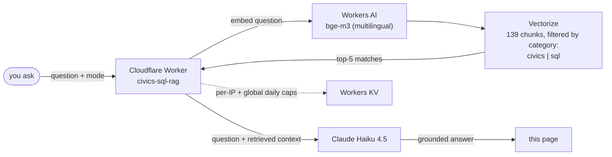

# 🦎 civics × sql — RAG practice lab

I wanted to stop treating RAG as a memorized diagram ("vector DB + chunks") and actually feel where it breaks — so I built a real Cloudflare Worker that answers real questions against real embedded content, grounded in the 128 official USCIS civics questions and my own hands-on SQL practice sessions (bugs included).

**[Live Demo →](https://evgeniimatveev.github.io/civics-sql-rag/)**


---

## What it does

Two modes over one Vectorize index, separated by metadata filtering:

- **Civics** — grounded in all 128 official USCIS 2025 naturalization test questions (M-1778)
- **SQL** — grounded in real hands-on SQL practice sessions, including real mistakes and their fixes (e.g. a timezone double-conversion bug caught mid-session)

Ask a question in any mode, in any language — it retrieves the most relevant
chunks by embedding similarity, then Claude Haiku 4.5 answers strictly from
that retrieved context (not from the model's general knowledge).

## Architecture



One index, two modes — `category` metadata filtering keeps civics and SQL
retrieval from ever bleeding into each other, instead of standing up two
separate Vectorize indexes for what is really one corpus with two audiences.

## Stack

| Layer | Tech |
|---|---|
| Embeddings | `@cf/baai/bge-m3` via Cloudflare Workers AI (1024-dim, multilingual) |
| Vector store | Cloudflare Vectorize (cosine similarity, metadata-filtered by `category`) |
| Generation | Claude Haiku 4.5 (Anthropic API) |
| Backend | Cloudflare Worker (`worker/worker.js`) |
| Rate limiting | Cloudflare KV (per-IP + global daily caps) |
| Frontend | Static HTML/JS (`index.html`) |

## Why this project exists

Built specifically to turn RAG from a memorized concept ("vector DB + chunks")
into hands-on intuition — chunking strategy, retrieval score tuning
(`MIN_SCORE` threshold), and how chunk *boundaries* matter more than chunk
*size* (each civics chunk = one question; each SQL chunk = one complete
lesson, never split mid-explanation).

## Real incident hit while building this

Filtered queries (`filter: { category: "civics" }`) silently returned zero
matches, even though the unfiltered query worked and the vectors clearly
existed. Root cause, confirmed by testing directly against the platform via
`wrangler vectorize query` (bypassing the Worker entirely): **Vectorize's
metadata index was created *after* the vectors were already upserted, and
per Cloudflare's own docs, "vectors upserted before a metadata index was
created won't have their metadata contained in that index."** It's not an
eventual-consistency delay — it never backfills on its own. Fix: re-run
`ingest.py` to re-upsert every vector once the metadata index exists. Lesson
for next time: create `wrangler vectorize create-metadata-index` **before**
the first ingest, not after.

## Repo layout

```
worker/
  worker.js              # Cloudflare Worker: /ask, /admin/ingest, /admin/debug-query, /stats
  wrangler.toml          # bindings: KV (rate limit), Vectorize, Workers AI
  rag/
    build_corpus.py      # civics_128_qa.md + sql/*.sql -> corpus.jsonl
    ingest.py            # POSTs corpus.jsonl to /admin/ingest (embeds + upserts)
    corpus.jsonl         # generated — chunked, tagged {id, source, category, text}
    civics/civics_128_qa.md
    sql/session_*.sql    # real practice sessions, added incrementally
index.html               # frontend
```

## Growing the corpus

The SQL side is meant to grow as practice continues (JOINs, subqueries,
window functions...). To add a new session:

1. Drop `session_0N_topic.sql` into `worker/rag/sql/`, following the existing
   `-- LESSON N: <title>` header convention.
2. `python worker/rag/build_corpus.py` — regenerates `corpus.jsonl` (idempotent, existing ids untouched).
3. `ADMIN_KEY=... python worker/rag/ingest.py` — upserts only what changed.

## Deploy

```
cd worker
npx wrangler kv namespace create RATE_LIMIT        # paste the id into wrangler.toml
npx wrangler vectorize create civics-sql-corpus-m3 --dimensions=1024 --metric=cosine
npx wrangler vectorize create-metadata-index civics-sql-corpus-m3 --property-name=category --type=string
npx wrangler deploy
npx wrangler secret put ADMIN_KEY
npx wrangler secret put ANTHROPIC_API_KEY
```

Create the metadata index **before** the first ingest (see incident above) —
then:

```
python rag/build_corpus.py
ADMIN_KEY=... python rag/ingest.py
```
